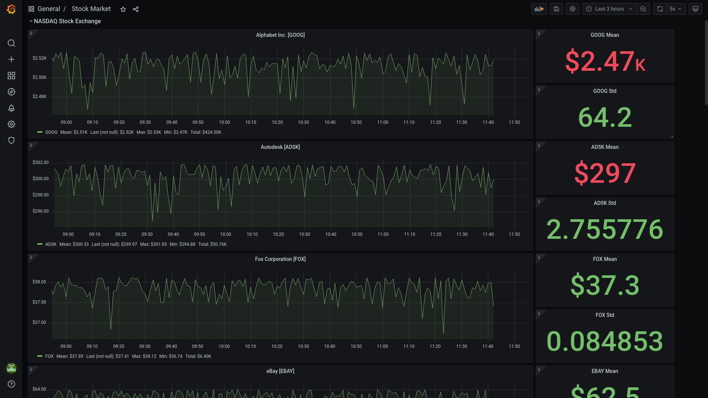

# Cloud Computing Project
Final project for the Cloud Computing course at University of Pisa.

# Stock Market time series analysis using OpenStack, Gnocchi and Grafana
The project focused on deploying Gnocchi - an open-source time series database -
and Grafana - an open source analytics and monitoring solution - on the preexisting
OpenStack installation. After deployment, some preliminary tests were carried
out in order to make sure everything was running smoothly. Finally, Gnocchi metrics
were created and populated using stock market data. Grafana was then used to
visualize the data and extract useful statistics.

# PageRank
