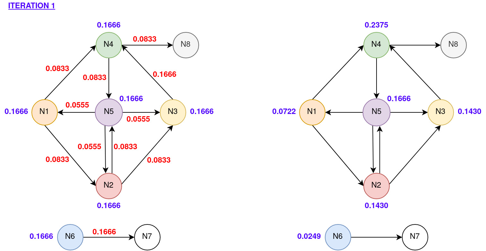

# Cloud Computing Project
Final project for the Cloud Computing course at University of Pisa.

# Stock Market time series analysis using OpenStack, Gnocchi and Grafana
The project focused on deploying Gnocchi - an open-source time series database -
and Grafana - an open source analytics and monitoring solution - on the preexisting
OpenStack installation. After deployment, some preliminary tests were carried
out in order to make sure everything was running smoothly. Finally, Gnocchi metrics
were created and populated using stock market data. Grafana was then used to
visualize the data and extract useful statistics.

# PageRank
The importance of a web page is an inherently subjective matter, which depends on the readers interests, knowledge and attitudes. PageRank can be defined as a method for rating web pages objectively and mechanically, effectively measuring the human interest and attention devoted to them. In order to measure the relative importance of web pages, PageRank was proposed as a method for computing a ranking for every web page based on the graph of the web.

The project focused on designing a MapReduce algorithm (using pseudocode) to implement the PageRank (using both Hadoop and Spark). Initially, a pseudocode implementation and the design assumptions are presented. The successive sections focus on the implementation details using both Hadoop and Spark. Finally, the validation results obtained using both a realistic and a synthetic dataset are provided.

