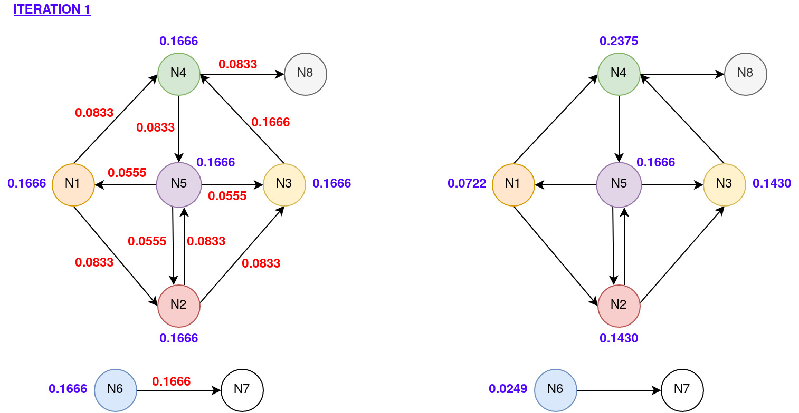

# PageRank
PageRank implementation using Hadoop and Spark.

# What to run
#### Hadoop
```bash
$ cd pagerank/hadooop/pagerank
$ mvn clean package
$ hadoop jar target/pagerank-1.0-SNAPSHOT.jar it.unipi.cc.hadoop.Driver 1 0.15 Test.txt
```
#### Spark
```bash
$ cd pagerank/spark
$ spark-submit pagerank.py 1 0.15 Test.txt
```

# What is PageRank
The importance of a web page is an inherently subjective matter, which depends on the readers interests, knowledge and attitudes. PageRank can be defined as a method for rating web pages objectively and mechanically, effectively measuring the human interest and attention devoted to them. In order to measure the relative importance of web pages, PageRank was proposed as a method for computing a ranking for every web page based on the graph of the web.

The project focused on designing a MapReduce algorithm (using pseudocode) to implement the PageRank (using both Hadoop and Spark). Initially, a pseudocode implementation and the design assumptions are presented. The successive sections focus on the implementation details using both Hadoop and Spark. Finally, the validation results obtained using both a realistic and a synthetic dataset are provided.

